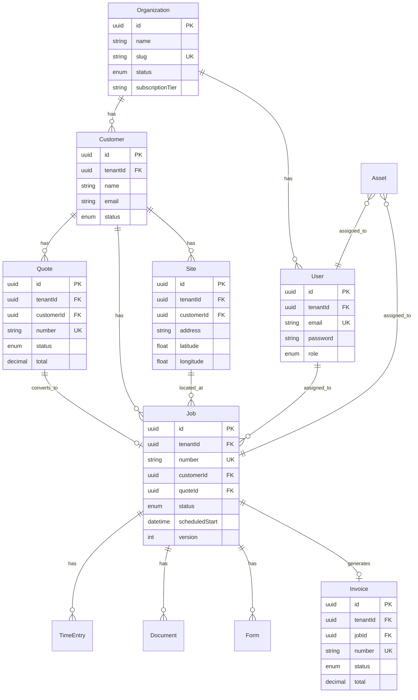

# Entity Relationship Diagram (ERD)

## Core Entities

```
┌─────────────────────┐
│   Organization      │
├─────────────────────┤
│ id (PK)             │
│ name                │
│ slug (unique)       │
│ status              │
│ subscriptionTier    │
│ maxUsers            │
└─────────────────────┘
         │
         │ 1:N
         ▼
┌─────────────────────┐       ┌─────────────────────┐
│      User           │       │     Customer        │
├─────────────────────┤       ├─────────────────────┤
│ id (PK)             │       │ id (PK)             │
│ tenantId (FK)       │       │ tenantId (FK)       │
│ email (unique)      │       │ name                │
│ password            │       │ email               │
│ role                │       │ phone               │
│ firstName           │       │ address             │
│ lastName            │       │ status              │
└─────────────────────┘       └─────────────────────┘
         │                             │
         │ 1:N                         │ 1:N
         ▼                             ▼
┌─────────────────────┐       ┌─────────────────────┐
│       Site          │       │       Quote         │
├─────────────────────┤       ├─────────────────────┤
│ id (PK)             │       │ id (PK)             │
│ tenantId (FK)       │       │ tenantId (FK)       │
│ customerId (FK)     │       │ customerId (FK)     │
│ name                │       │ number              │
│ address             │       │ status              │
│ city                │       │ validUntil          │
│ latitude            │       │ subtotal            │
│ longitude           │       │ tax                 │
│ contactName         │       │ total               │
└─────────────────────┘       └─────────────────────┘
         │                             │
         │ 1:N                         │ 1:N (convert)
         ▼                             ▼
┌─────────────────────────────────────────────────┐
│                    Job                          │
├─────────────────────────────────────────────────┤
│ id (PK)                                         │
│ tenantId (FK)                                   │
│ number (unique per tenant)                      │
│ customerId (FK)                                 │
│ siteId (FK, nullable)                           │
│ quoteId (FK, nullable)                          │
│ title                                           │
│ description                                     │
│ status (SCHEDULED, IN_PROGRESS, COMPLETED, etc) │
│ priority (LOW, MEDIUM, HIGH, URGENT)            │
│ scheduledStart                                  │
│ scheduledEnd                                    │
│ assignedTechnicianId (FK User)                  │
│ version (optimistic locking)                    │
│ createdAt                                       │
│ updatedAt                                       │
└─────────────────────────────────────────────────┘
         │ 1:N                  │ 1:N              │ 1:1 (convert)
         ▼                      ▼                  ▼
┌──────────────┐    ┌──────────────┐    ┌──────────────┐
│ TimeEntry    │    │   Asset      │    │  Invoice     │
├──────────────┤    ├──────────────┤    ├──────────────┤
│ id (PK)      │    │ id (PK)      │    │ id (PK)      │
│ jobId (FK)   │    │ id (PK)      │    │ jobId (FK)   │
│ techId (FK)  │    │ tenantId(FK) │    │ number       │
│ startTime    │    │ code         │    │ status       │
│ endTime      │    │ name         │    │ dueDate      │
│ duration     │    │ category     │    │ paidAt       │
│ billable     │    │ status       │    │ subtotal     │
└──────────────┘    │ assignedTo   │    │ tax          │
                    └──────────────┘    │ total        │
                                        └──────────────┘
         │ 1:N                                │ 1:N
         ▼                                    ▼
┌──────────────┐                    ┌──────────────┐
│ Document     │                    │ LineItem     │
├──────────────┤                    ├──────────────┤
│ id (PK)      │                    │ id (PK)      │
│ tenantId(FK) │                    │ invoiceId(FK)│
│ name         │                    │ description  │
│ type         │                    │ quantity     │
│ url          │                    │ unitPrice    │
│ jobId (FK)   │                    │ amount       │
│ assetId (FK) │                    └──────────────┘
└──────────────┘

┌──────────────┐
│    Form      │
├──────────────┤
│ id (PK)      │
│ tenantId(FK) │
│ templateId   │
│ jobId (FK)   │
│ status       │
│ fields (JSON)│
│ version      │
└──────────────┘

┌──────────────┐           ┌──────────────┐
│ PriceItem    │           │ Inventory    │
├──────────────┤           ├──────────────┤
│ id (PK)      │           │ id (PK)      │
│ tenantId(FK) │           │ tenantId(FK) │
│ code         │           │ sku          │
│ name         │           │ name         │
│ category     │           │ quantity     │
│ unitPrice    │           │ reorderLevel │
│ taxable      │           │ location     │
└──────────────┘           └──────────────┘
```

## Key Relationships

### Multi-Tenancy
- All entities (except Organization and User) have `tenantId` for isolation
- Prisma middleware enforces tenant filtering on all queries
- Row-Level Security at application level

### Quote → Job → Invoice Flow
1. Quote created for Customer
2. Quote approved
3. Quote converted to Job (quoteId FK)
4. Job completed
5. Invoice created from Job (jobId FK)

### Asset Assignment
- Assets can be assigned to:
  - Jobs (`assignedToJobId`)
  - Technicians (`assignedToTechnicianId`)
  - Sites (`assignedToSiteId`)

### Document Attachments
- Documents can be linked to:
  - Jobs
  - Assets
  - Customers (via site)

### Optimistic Locking
- Jobs, Assets, Forms have `version` field
- Client sends version on update
- Server checks version match, rejects if stale (409 Conflict)

## Indexes

### High-Query Performance
```sql
-- Jobs
CREATE INDEX idx_jobs_tenant_status ON jobs(tenantId, status);
CREATE INDEX idx_jobs_assigned_tech ON jobs(assignedTechnicianId);
CREATE INDEX idx_jobs_scheduled_start ON jobs(scheduledStart);

-- Customers
CREATE INDEX idx_customers_tenant_status ON customers(tenantId, status);
CREATE INDEX idx_customers_email ON customers(email);

-- Sites
CREATE INDEX idx_sites_customer ON sites(customerId);
CREATE INDEX idx_sites_location ON sites(latitude, longitude);

-- Time Entries
CREATE INDEX idx_time_entries_job ON time_entries(jobId);
CREATE INDEX idx_time_entries_tech_date ON time_entries(technicianId, startTime);

-- Inventory
CREATE INDEX idx_inventory_sku ON inventory_items(sku);
CREATE INDEX idx_inventory_quantity ON inventory_items(quantity);
```

## Mermaid ERD



## Data Types

- **UUID**: Primary keys for all entities
- **Timestamps**: ISO 8601 format (UTC)
- **Decimals**: Monetary values (precision 10, scale 2)
- **Enums**: Status fields, categories, roles
- **JSON**: Flexible fields (form fields, custom data)

## Constraints

- **Foreign Keys**: Cascade on delete where appropriate
- **Unique Constraints**: Email (per tenant), slugs, numbers
- **Not Null**: Critical fields (tenantId, email, status)
- **Check Constraints**: Valid enums, positive quantities
