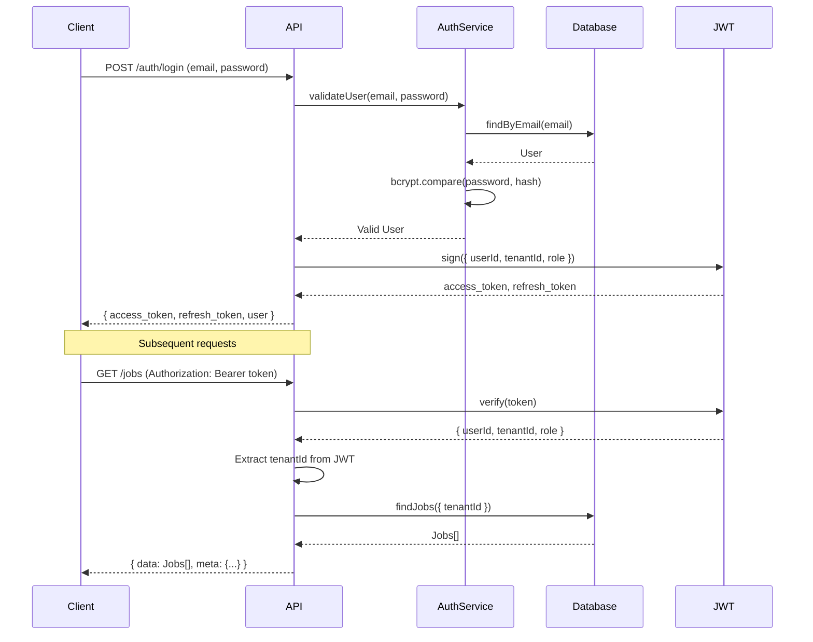
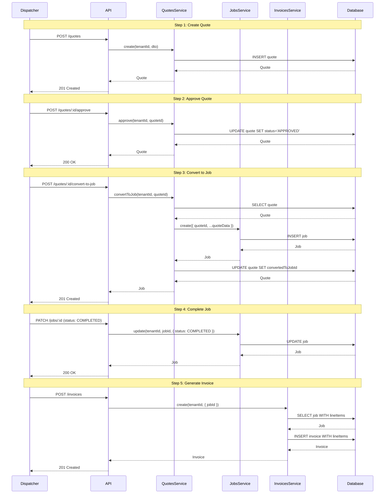
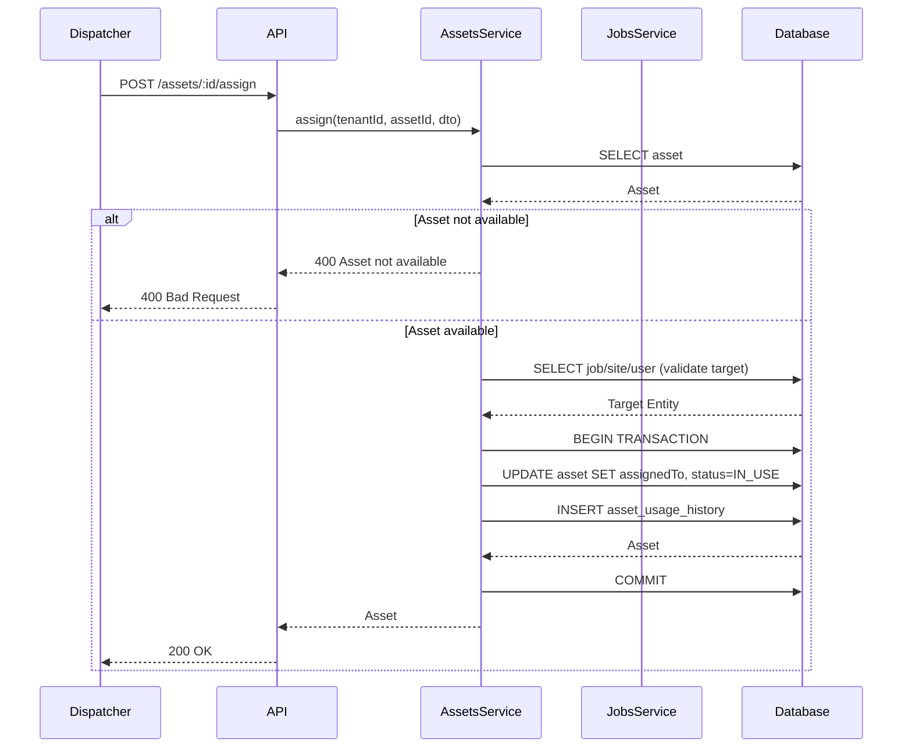
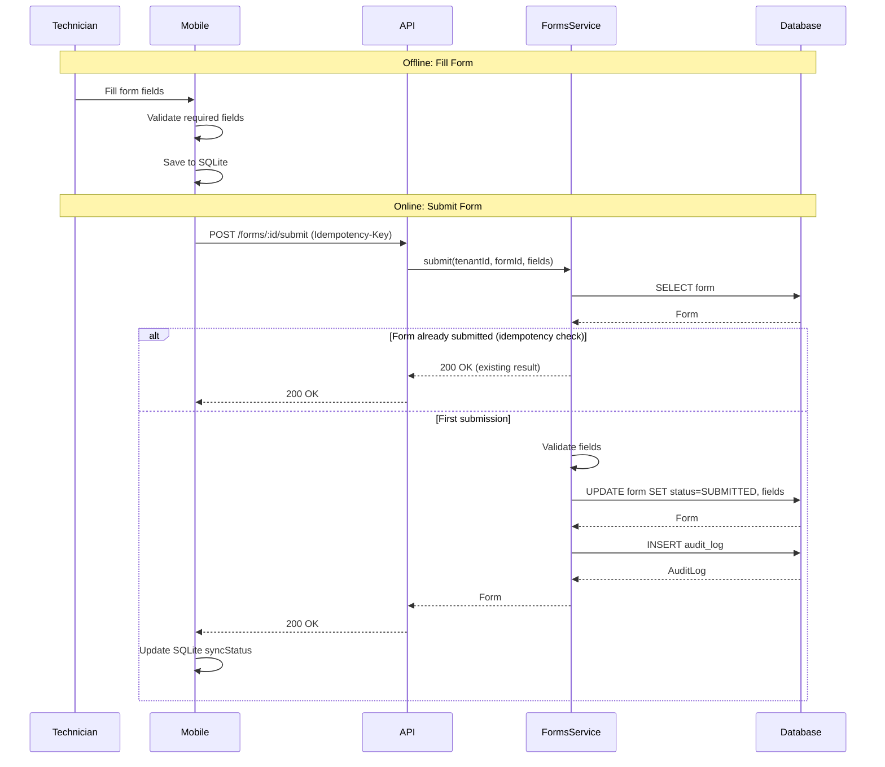
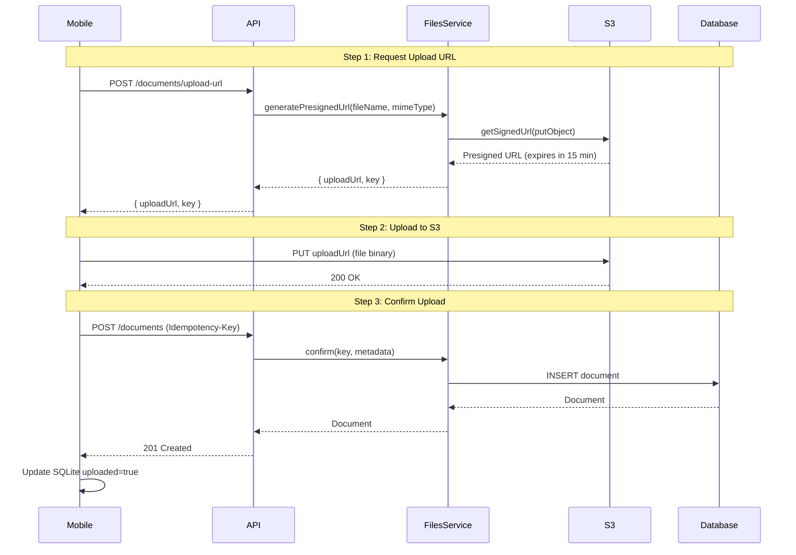
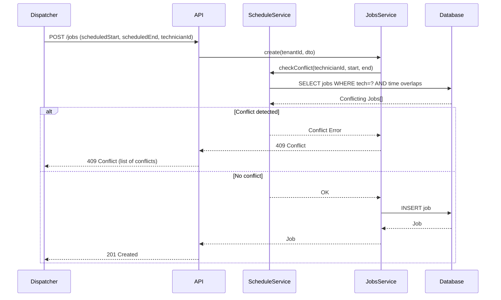
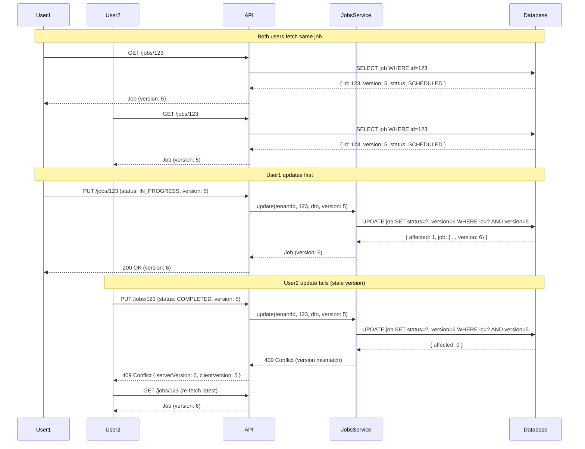

# Sequence Diagrams

## 1. Authentication Flow

## 2. Quote → Job → Invoice Flow

## 3. Asset Assignment Flow

## 4. Form Submission Flow

## 5. Document Upload Flow (Presigned URLs)

## 6. Schedule Conflict Detection

## 7. Optimistic Locking (Concurrent Updates)

## Notes

- All sequences include **tenant isolation** via `tenantId` from JWT
- **Idempotency keys** prevent duplicate operations from retries
- **Optimistic locking** prevents lost updates in concurrent scenarios
- **Presigned URLs** eliminate backend load for file uploads
- **Offline-first** mobile syncs queued operations when online
